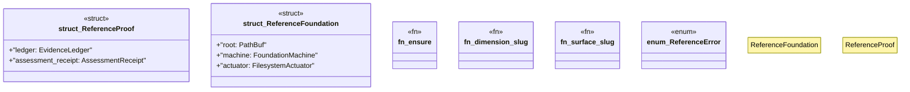

# `crates/ggen-graph/src/rwr/reference.rs`

Source SHA-256: `0b22943f87ac030cf38218905ea81cc61e59929ae680c83e5bdd9fec439680d1`

## Dependencies

- `crate::rwr::autonomic::{AutonomicController, AutonomicError, ManagedCell}`
- `crate::rwr::evidence::{ AssessmentReceipt, EvidenceError, EvidenceLedger, EvidenceOutcome, EvidenceRecord, GallState, }`
- `crate::rwr::execution::{ Action, ActuationReceipt, ExecutionError, ExecutionPolicy, FilesystemActuator, FoundationMachine, ReplayVerifier, }`
- `crate::rwr::matrix::{contract, Dimension, MaturityLevel, ALL_DIMENSIONS, MATRIX_VERSION}`
- `serde::{Deserialize, Serialize}`
- `serde_json::{json, Value}`
- `std::fs::File`
- `std::io::Read`
- `std::path::{Path, PathBuf}`

## Standing

- Structural parse: `ALIVE`
- Runtime behavior: `UNKNOWN`
