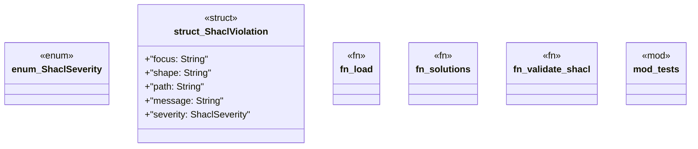

# `crates/ggen-graph/src/shacl.rs`

Source SHA-256: `221c6d3d6a2b53eb8480a3e68963de5d08ba03f572bf635219157f5a2999f030`

## Dependencies

- `crate::GraphError`
- `oxigraph::io::{RdfFormat, RdfParser}`
- `oxigraph::model::Term`
- `oxigraph::sparql::{QueryResults, SparqlEvaluator}`
- `oxigraph::store::Store`
- `super::*`

## Standing

- Structural parse: `ALIVE`
- Runtime behavior: `UNKNOWN`
