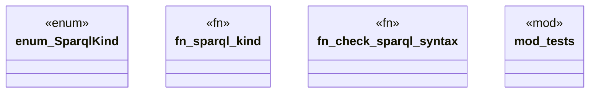

# `crates/ggen-graph/src/sparql.rs`

Source SHA-256: `289ab7ae86101c8c5a8e1868be219a53bed26c0584a7cd91b75fd5bef7b18640`

## Dependencies

- `oxigraph::sparql::SparqlEvaluator`
- `super::*`

## Standing

- Structural parse: `ALIVE`
- Runtime behavior: `UNKNOWN`
