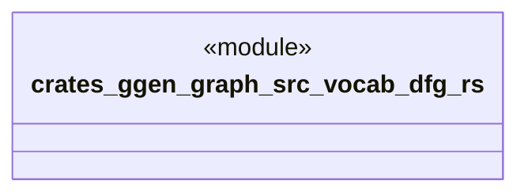

# `crates/ggen-graph/src/vocab/dfg.rs`

Source SHA-256: `80fa969c5052534d464cc747bc992aae193bafb8a882e0b33b8b7d1804c56641`

## Dependencies

- `oxigraph::model::NamedNodeRef`

## Standing

- Structural parse: `ALIVE`
- Runtime behavior: `UNKNOWN`
