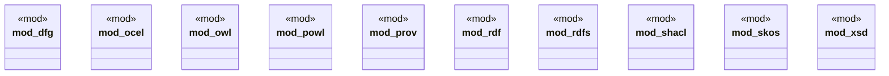

# `crates/ggen-graph/src/vocab/mod.rs`

Source SHA-256: `c159c21422795aee727c412f75f3d8e136270921a0aefd5d980dc549511f47ff`

## Dependencies

- `dfg as Dfg`
- `ocel as OCEL`
- `ocel as Ocel`
- `owl as OWL`
- `owl as Owl`
- `powl as Powl`
- `prov as PROV`
- `prov as Prov`
- `rdf as RDF`
- `rdf as Rdf`
- `rdfs as RDFS`
- `rdfs as Rdfs`
- `shacl as SHACL`
- `shacl as Shacl`
- `skos as SKOS`
- `skos as Skos`
- `xsd as XSD`
- `xsd as Xsd`

## Standing

- Structural parse: `ALIVE`
- Runtime behavior: `UNKNOWN`
