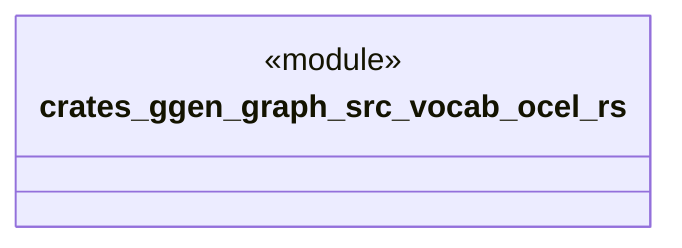

# `crates/ggen-graph/src/vocab/ocel.rs`

Source SHA-256: `f7de8d7fde7c53e900aa0060d5ad2371ac38b7f3830bfe962895d0aad788b7c3`

## Dependencies

- `oxigraph::model::NamedNodeRef`

## Standing

- Structural parse: `ALIVE`
- Runtime behavior: `UNKNOWN`
