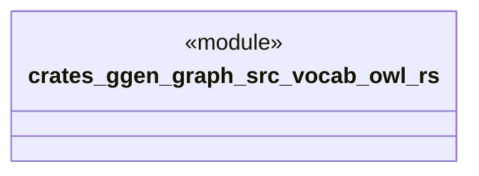

# `crates/ggen-graph/src/vocab/owl.rs`

Source SHA-256: `7b74b96241f1298f26317495732fbe7486981bb8df7d4ff31d2975d83f15e0e3`

## Dependencies

- `oxigraph::model::NamedNodeRef`

## Standing

- Structural parse: `ALIVE`
- Runtime behavior: `UNKNOWN`
