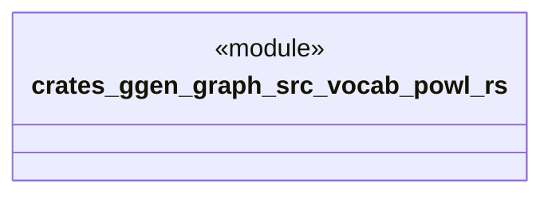

# `crates/ggen-graph/src/vocab/powl.rs`

Source SHA-256: `2417def63787f06608abc81c851354bc55771fdccce605bcefc9f44320b6e514`

## Dependencies

- `oxigraph::model::NamedNodeRef`

## Standing

- Structural parse: `ALIVE`
- Runtime behavior: `UNKNOWN`
