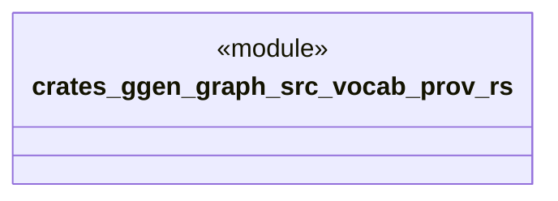

# `crates/ggen-graph/src/vocab/prov.rs`

Source SHA-256: `934a31f007c57f450d451bd958fd06510b54832e4365224fb9aacb0c83dea7e1`

## Dependencies

- `oxigraph::model::NamedNodeRef`

## Standing

- Structural parse: `ALIVE`
- Runtime behavior: `UNKNOWN`
