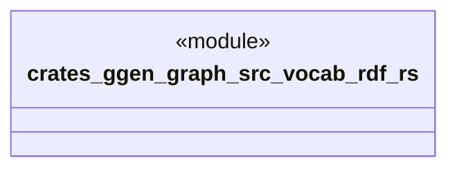

# `crates/ggen-graph/src/vocab/rdf.rs`

Source SHA-256: `6f72bf452d536621f5ba7ac5b7487a1181cc12f6f72f7d3b2e3ce25c826c59c2`

## Dependencies

- `oxigraph::model::NamedNodeRef`

## Standing

- Structural parse: `ALIVE`
- Runtime behavior: `UNKNOWN`
