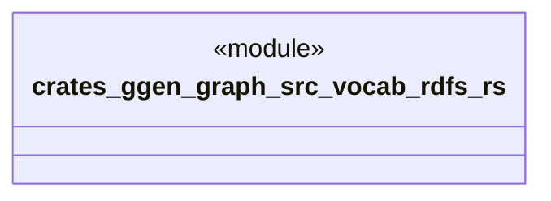

# `crates/ggen-graph/src/vocab/rdfs.rs`

Source SHA-256: `6f79ca83baa379495b123f0a100dbb2969194e5a4537ba8917b8e8aad807935b`

## Dependencies

- `oxigraph::model::NamedNodeRef`

## Standing

- Structural parse: `ALIVE`
- Runtime behavior: `UNKNOWN`
