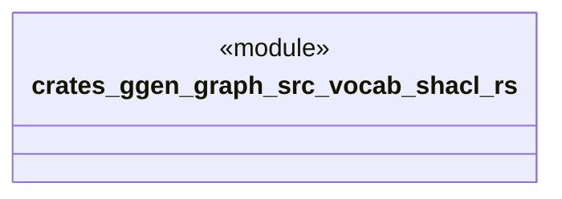

# `crates/ggen-graph/src/vocab/shacl.rs`

Source SHA-256: `eb517eac38ddc0113edd9c62590d923773b54e9e85d91feaa4499e015c30eb7a`

## Dependencies

- `oxigraph::model::NamedNodeRef`

## Standing

- Structural parse: `ALIVE`
- Runtime behavior: `UNKNOWN`
