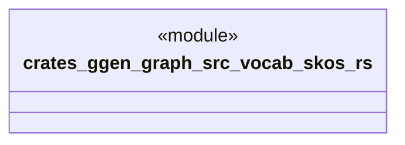

# `crates/ggen-graph/src/vocab/skos.rs`

Source SHA-256: `e412b0b6ce8758e14c060eab66267b704c16076e53f2f1daf31aee3a04f0c3cc`

## Dependencies

- `oxigraph::model::NamedNodeRef`

## Standing

- Structural parse: `ALIVE`
- Runtime behavior: `UNKNOWN`
