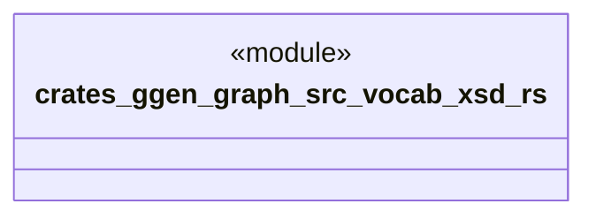

# `crates/ggen-graph/src/vocab/xsd.rs`

Source SHA-256: `3e9087bfef4904cbf359d08f380f064512ef9423e3756dbe747e239c5f0e22f5`

## Dependencies

- `oxigraph::model::NamedNodeRef`

## Standing

- Structural parse: `ALIVE`
- Runtime behavior: `UNKNOWN`
