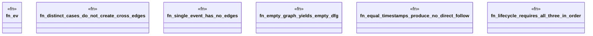

# `crates/ggen-graph/tests/adversarial_dfg_test.rs`

Source SHA-256: `ce71c83518d2e4c1972fd7eb26e58c916af253e739ea37123817029277627a51`

## Dependencies

- `chrono::{TimeZone, Utc}`
- `ggen_graph::ocel::{EvidenceProjector, OcelEvent, OcelLog, OcelObjectRef}`
- `ggen_graph::{check_lifecycle_order, discover_dfg, DeterministicGraph}`
- `std::collections::HashMap`

## Standing

- Structural parse: `ALIVE`
- Runtime behavior: `UNKNOWN`
