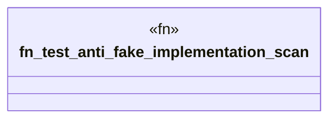

# `crates/ggen-graph/tests/anti_fake_implementation.rs`

Source SHA-256: `d1fed125026cec2f8e527c417d5f19a58a9df13593478dedf65fba0c9ac39578`

## Dependencies

- `std::error::Error`
- `std::fs`
- `std::path::Path`

## Standing

- Structural parse: `ALIVE`
- Runtime behavior: `UNKNOWN`
