# `crates/ggen-graph/tests/automatic_autonomic_v26_7_31.rs`

Source SHA-256: `0bc7406d3e5314178bbe041e739e24f64b0f9731297fd41c81966b33237fb6fe`

```mermaid
classDiagram
    class fn_machine {
      <<fn>>
    }
    class fn_router {
      <<fn>>
    }
    class fn_runtime {
      <<fn>>
    }
    class struct_FlakyObserver {
      <<struct>>
      +"failures_remaining: u8"
    }
    class struct_MismatchObserver {
      <<struct>>
    }
    class fn_crown_inventory_is_15_capabilities_times_3_surfaces {
      <<fn>>
    }
    class fn_trigger_to_consequence_is_fully_automatic_and_causally_receipted {
      <<fn>>
    }
    class fn_admission_routing_intent_and_grant_fail_closed {
      <<fn>>
    }
    class fn_idempotency_atomicity_and_replay_are_enforced {
      <<fn>>
    }
    class fn_retry_circuit_breaker_and_andon_are_bounded {
      <<fn>>
    }
    class fn_error_budget_gates_risky_change {
      <<fn>>
    }
    class fn_failed_postcondition_executes_lawful_inverse {
      <<fn>>
    }
    class fn_autonomic_controller_repairs_and_records_knowledge {
      <<fn>>
    }
    note "ConsequenceObserver for FlakyObserver"
    note "ConsequenceObserver for MismatchObserver"
```

## Dependencies

- `ggen_graph::rwr::{ read_committed_payload, Action, AndonLevel, AutomaticReplayVerifier, AutomaticRuntime, AutonomicOperationsController, AutonomicResource, CircuitBreaker, ConsequenceObserver, Dimension, ErrorBudget, ExecutionError, ExecutionPolicy, FilesystemActuator, FilesystemConsequenceObserver, FoundationMachine, ObservationError, OperationsError, OperationsGovernor, RetryPolicy, Route, Trigger, TriggerAdmissionPolicy, TriggerRouter, ALL_OPERATIONS_CAPABILITIES, REQUIRED_OPERATIONS_PROOF_SURFACES, }`

## Standing

- Structural parse: `ALIVE`
- Runtime behavior: `UNKNOWN`
