# `crates/ggen-graph/tests/coherence_hash_expectations_test.rs`

Source SHA-256: `7220570ad29a759ec5917d0c08568b548634c3c482a5dc8520932a549d6b7cb9`

```mermaid
classDiagram
    class fn_test_ontology_hash_mismatch_against_expectation {
      <<fn>>
    }
    class fn_test_artifact_hash_mismatch_against_expectation {
      <<fn>>
    }
    class fn_test_event_log_hash_mismatch_against_expectation {
      <<fn>>
    }
    class fn_test_rule_6_cross_pole_coherence_fracture {
      <<fn>>
    }
    class fn_test_multiple_poles_with_hash_mismatches {
      <<fn>>
    }
    class fn_test_empty_expectations_produces_no_hash_drifts {
      <<fn>>
    }
    class fn_test_matching_expectations_no_hash_drift {
      <<fn>>
    }
    class fn_test_partial_expectations_only_checks_declared_poles {
      <<fn>>
    }
    class fn_test_expectations_do_not_suppress_count_discrepancies {
      <<fn>>
    }
```

## Dependencies

- `ggen_graph::coherence::{CoherenceChecker, CoherenceDrift, DriftKind, Pole}`
- `std::collections::HashMap`

## Standing

- Structural parse: `ALIVE`
- Runtime behavior: `UNKNOWN`
