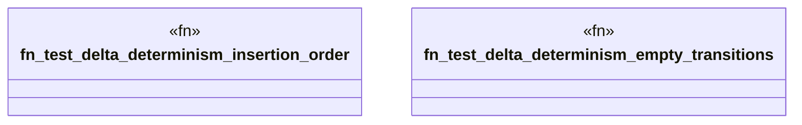

# `crates/ggen-graph/tests/delta_determinism.rs`

Source SHA-256: `d4fd7580434d23707d078cb5506ed6ab1a4486508102f571fb8fc5a8d4f0da93`

## Dependencies

- `ggen_graph::{DeterministicGraph, RdfDelta}`
- `std::error::Error`

## Standing

- Structural parse: `ALIVE`
- Runtime behavior: `UNKNOWN`
