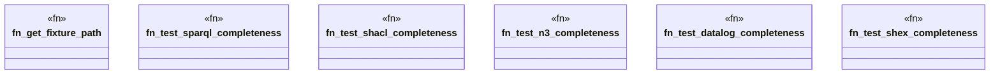

# `crates/ggen-graph/tests/dialect_completeness.rs`

Source SHA-256: `d3e3d835eb135a8bb8a99a118d3a0e19d3adb783b3e54f3323cfba9fd38b538d`

## Dependencies

- `ggen_graph::dialect::{check_datalog, check_n3, check_shacl, check_shex, check_sparql}`
- `oxigraph::io::{RdfFormat, RdfParser}`
- `oxigraph::store::Store`
- `std::fs`
- `std::path::Path`

## Standing

- Structural parse: `ALIVE`
- Runtime behavior: `UNKNOWN`
