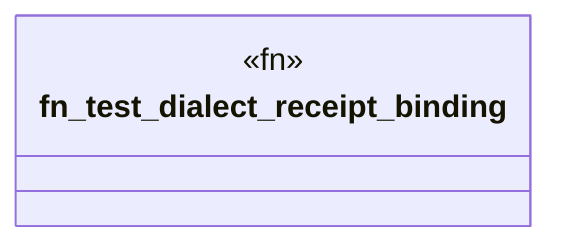

# `crates/ggen-graph/tests/dialect_receipts.rs`

Source SHA-256: `3a3d1c39faf43fdae0f1b3bd2bd19d7f99521e7b895fc7e03be936b73e20b92e`

## Dependencies

- `ggen_graph::dialect::check_n3`

## Standing

- Structural parse: `ALIVE`
- Runtime behavior: `UNKNOWN`
