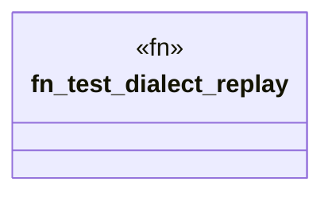

# `crates/ggen-graph/tests/dialect_replay.rs`

Source SHA-256: `acf082b854d52c0f1674cd6f5b819598e92b2f5f9202ef61c1fba4fffe0dcaf6`

## Dependencies

- `ggen_graph::dialect::{check_n3, check_sparql}`

## Standing

- Structural parse: `ALIVE`
- Runtime behavior: `UNKNOWN`
