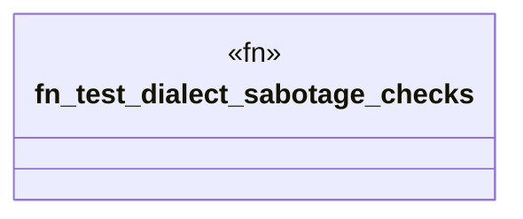

# `crates/ggen-graph/tests/dialect_sabotage.rs`

Source SHA-256: `d7776f723e229e1594de6d1a6a0587346d6b213a6621165404e90d3722f80021`

## Dependencies

- `ggen_graph::dialect::{check_datalog, check_n3, check_shacl, check_shex, check_sparql}`

## Standing

- Structural parse: `ALIVE`
- Runtime behavior: `UNKNOWN`
