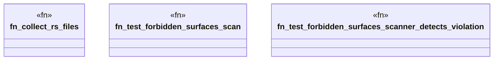

# `crates/ggen-graph/tests/forbidden_surface.rs`

Source SHA-256: `200452b1a6d0f914d3aa3fa2f31555b892bbbeae2ef58a30c0dc14fc95a04684`

## Dependencies

- `std::error::Error`
- `std::fs`
- `std::path::{Path, PathBuf}`

## Standing

- Structural parse: `ALIVE`
- Runtime behavior: `UNKNOWN`
