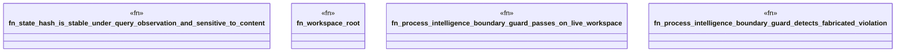

# `crates/ggen-graph/tests/graph_hashing_evidence_test.rs`

Source SHA-256: `e8c886b1e5ee0d8a5ca986abd439e8321295e4acb42a9a5c7535d682f1cb6451`

## Dependencies

- `ggen_graph::DeterministicGraph`
- `std::path::Path`
- `std::process::Command`

## Standing

- Structural parse: `ALIVE`
- Runtime behavior: `UNKNOWN`
