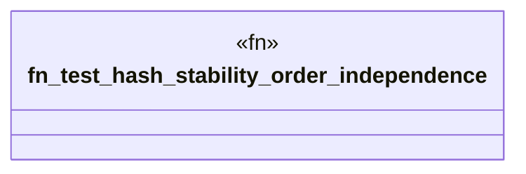

# `crates/ggen-graph/tests/hash_stability.rs`

Source SHA-256: `0d9027fe9f23c8953753ea726859ec05685a7e48d40872c16e081cff48020ca2`

## Dependencies

- `ggen_graph::DeterministicGraph`
- `std::error::Error`

## Standing

- Structural parse: `ALIVE`
- Runtime behavior: `UNKNOWN`
