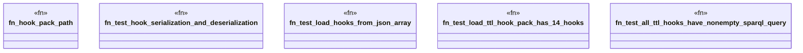

# `crates/ggen-graph/tests/hook_loader.rs`

Source SHA-256: `25152b91d23147ddbbd08bfcf147f671b813807928113528491b5e00b9891d7a`

## Dependencies

- `ggen_graph::{DeterministicGraph, KnowledgeHook}`
- `oxigraph::io::{RdfFormat, RdfParser}`
- `oxigraph::sparql::QueryResults`
- `oxigraph::store::Store`
- `std::error::Error`
- `std::fs`
- `std::path::Path`

## Standing

- Structural parse: `ALIVE`
- Runtime behavior: `UNKNOWN`
