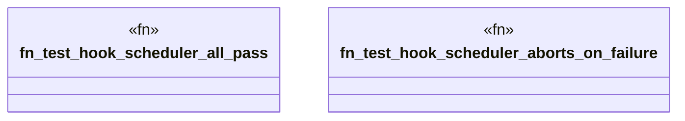

# `crates/ggen-graph/tests/hook_scheduler.rs`

Source SHA-256: `ab9efc9d69ae40baa2785292e4823c057d480cdb0792a1677114100befc506e4`

## Dependencies

- `ggen_graph::{DeterministicGraph, KnowledgeHook, RdfDelta}`
- `std::error::Error`

## Standing

- Structural parse: `ALIVE`
- Runtime behavior: `UNKNOWN`
