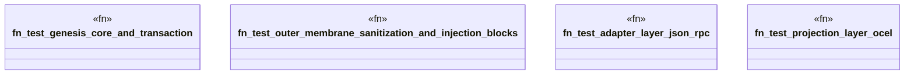

# `crates/ggen-graph/tests/interchangeable_test.rs`

Source SHA-256: `f9293926a981e90946b49c92656d23eb2fea55764696f467dbbfe11b2743c221`

## Dependencies

- `ggen_graph::graph::quad::parse_nquad`
- `ggen_graph::ocel::{OcelEvent, OcelLog, OcelObject}`
- `ggen_graph::{AdapterLayer, GenesisCore, OuterMembrane, ProjectionLayer}`
- `serde_json::json`

## Standing

- Structural parse: `ALIVE`
- Runtime behavior: `UNKNOWN`
