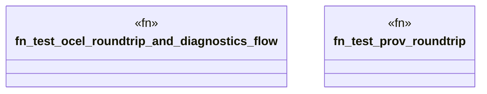

# `crates/ggen-graph/tests/ocel_diagnostics_doctor_test.rs`

Source SHA-256: `214be333abcc59e09b05ae8bf43c6cf3688abb203f541a445022002183f7338f`

## Dependencies

- `chrono::{TimeZone, Utc}`
- `ggen_graph::DeterministicGraph`
- `ggen_graph::diagnostics::{DiagnosticStatus, DiagnosticsRunner}`
- `ggen_graph::doctor::ProcessDoctor`
- `ggen_graph::ocel::{ EvidenceProjector, OcelEvent, OcelLog, OcelObject, OcelObjectRef, ProvActivity, ProvAgent, ProvDocument, ProvEntity, ProvGeneration, ProvUsage, }`
- `std::collections::HashMap`

## Standing

- Structural parse: `ALIVE`
- Runtime behavior: `UNKNOWN`
