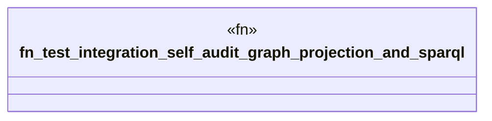

# `crates/ggen-graph/tests/ocel_self_audit.rs`

Source SHA-256: `fbb3c179d921e90ff165a6afa093b64ba0716c2e87d5793756e37e1b2cbecf5f`

## Dependencies

- `ggen_graph::DeterministicGraph`
- `ggen_graph::ocel::{ extract_self_audit, generate_self_audit_log, project_self_audit, query_relationship, }`

## Standing

- Structural parse: `ALIVE`
- Runtime behavior: `UNKNOWN`
