# `crates/ggen-graph/tests/post_chatman_coherence_integration.rs`

Source SHA-256: `96d777ca9a46b8c4bc9a48a5e95f02f76bca95465d0ee8dd034e56c77f4ebca4`

```mermaid
classDiagram
    class fn_test_three_pole_full_coherence_all_poles_present {
      <<fn>>
    }
    class fn_test_coherence_empty_event_log_produces_count_discrepancy {
      <<fn>>
    }
    class fn_test_coherence_fingerprints_are_deterministic {
      <<fn>>
    }
    class fn_test_coherence_different_inputs_produce_different_hashes {
      <<fn>>
    }
    class fn_test_coherence_missing_ontology_pole_not_admitted {
      <<fn>>
    }
    class fn_test_coherence_report_operation_ids_are_unique_across_calls {
      <<fn>>
    }
    class fn_test_coherence_zero_artifacts_with_triples_emits_o_to_a_discrepancy {
      <<fn>>
    }
    class fn_test_coherence_realistic_multi_triple_ontology {
      <<fn>>
    }
```

## Dependencies

- `ggen_graph::coherence::{CoherenceChecker, DriftKind, Pole}`

## Standing

- Structural parse: `ALIVE`
- Runtime behavior: `UNKNOWN`
