# `crates/ggen-graph/tests/post_chatman_roundtrip_full_test.rs`

Source SHA-256: `bd251a8e7a810890d610d2896a8799da46600833010a04fb692247fc30242bd0`

```mermaid
classDiagram
    class fn_test_post_chatman_roundtrip_scenario_1_happy_path_coherent {
      <<fn>>
    }
    class fn_test_post_chatman_roundtrip_scenario_2_sabotage_artifact {
      <<fn>>
    }
    class fn_test_post_chatman_roundtrip_scenario_3_sabotage_ontology {
      <<fn>>
    }
    class fn_test_post_chatman_roundtrip_scenario_4_sabotage_event_log {
      <<fn>>
    }
    class fn_test_post_chatman_roundtrip_scenario_5_invalid_signature_fail_closed {
      <<fn>>
    }
    class fn_test_post_chatman_roundtrip_full_integration_all_poles_present {
      <<fn>>
    }
    class fn_test_post_chatman_roundtrip_cross_pole_hash_comparison_o_vs_l {
      <<fn>>
    }
    class fn_test_post_chatman_roundtrip_missing_pole_blocks_admission {
      <<fn>>
    }
    class fn_test_post_chatman_roundtrip_all_poles_empty_admitted {
      <<fn>>
    }
```

## Dependencies

- `chrono::Utc`
- `ed25519_dalek::{Signer, SigningKey, Verifier}`
- `ggen_graph::coherence::{CoherenceChecker, CoherenceDrift, DriftKind, Pole, PoleState}`
- `ggen_graph::ocel::pack_events::{emit_pack_install, emit_pack_verify}`
- `serde_json::json`
- `std::collections::HashMap`

## Standing

- Structural parse: `ALIVE`
- Runtime behavior: `UNKNOWN`
