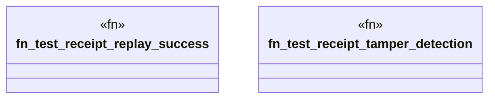

# `crates/ggen-graph/tests/receipt_replay.rs`

Source SHA-256: `f5ced24973ef801bcb75bae0b3504f56643d0b08557a51ef3f74556426b3d1ac`

## Dependencies

- `ggen_graph::{DeterministicGraph, RdfDelta}`
- `std::error::Error`

## Standing

- Structural parse: `ALIVE`
- Runtime behavior: `UNKNOWN`
