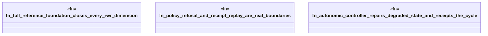

# `crates/ggen-graph/tests/rwr_level5_e2e.rs`

Source SHA-256: `1e58853995c60c73bcba58a23f378160f94c65eb7af883596f1fb9875fb95388`

## Dependencies

- `ggen_graph::rwr::{ Action, AutonomicController, Dimension, ExecutionError, ExecutionPolicy, FilesystemActuator, FoundationMachine, GallState, ManagedCell, ReferenceFoundation, ReplayVerifier, ALL_DIMENSIONS, }`
- `std::fs::File`
- `std::io::Read`

## Standing

- Structural parse: `ALIVE`
- Runtime behavior: `UNKNOWN`
