# `crates/ggen-graph/tests/sparql_actuation.rs`

Source SHA-256: `2404e8b9a0d1983500e8c15edcfd5864a0ef7cb4f6131ef3ee3495b3a65f491b`

```mermaid
classDiagram
    class fn_test_sparql_select_query_solutions {
      <<fn>>
    }
    class fn_test_sparql_malformed_query_error {
      <<fn>>
    }
    class fn_test_sparql_unsupported_construct_error {
      <<fn>>
    }
    class fn_test_hook_pack_w0_construct_query_against_real_store {
      <<fn>>
    }
    class fn_test_hook_pack_w0_construct_query_empty_store_returns_nonconforming_report {
      <<fn>>
    }
    class fn_test_all_hook_pack_queries_are_valid_sparql {
      <<fn>>
    }
```

## Dependencies

- `ggen_graph::DeterministicGraph`
- `oxigraph::io::{RdfFormat, RdfParser}`
- `oxigraph::sparql::QueryResults`
- `oxigraph::store::Store`
- `std::error::Error`
- `std::fs`
- `std::path::Path`

## Standing

- Structural parse: `ALIVE`
- Runtime behavior: `UNKNOWN`
