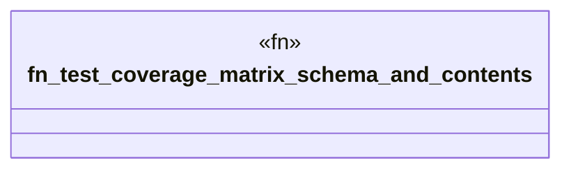

# `crates/ggen-graph/tests/vision2030_coverage.rs`

Source SHA-256: `7e260c8b19ab2a73ccb9be10ae18de34a548d29ad0ab1f42757dde8c2d4a4ce1`

## Dependencies

- `ggen_graph::ocel::{generate_coverage_matrix, CoverageMatrix}`
- `std::fs::File`
- `std::io::BufReader`
- `std::path::Path`

## Standing

- Structural parse: `ALIVE`
- Runtime behavior: `UNKNOWN`
