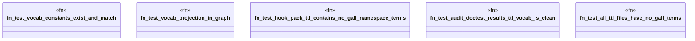

# `crates/ggen-graph/tests/vocab_projection.rs`

Source SHA-256: `368ed1aa4f5fd614d8cc88d4f5bf446651e34b7a173e3843b6f0050425fd1f51`

## Dependencies

- `ggen_graph::{vocab, DeterministicGraph}`
- `oxigraph::io::{RdfFormat, RdfParser}`
- `oxigraph::model::{NamedNode, Quad}`
- `oxigraph::sparql::QueryResults`
- `oxigraph::store::Store`
- `std::error::Error`
- `std::fs`
- `std::path::Path`

## Standing

- Structural parse: `ALIVE`
- Runtime behavior: `UNKNOWN`
