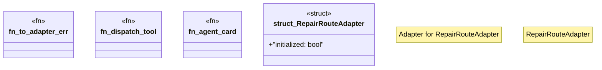

# `crates/ggen-lsp/src/a2a/mod.rs`

Source SHA-256: `bd7ce15e4a5062426404ca8b2408245d8a60d135128655685b1529615272b97c`

## Dependencies

- `async_trait::async_trait`
- `crate::a2a_mcp::a2a_generated::adapter::{ Adapter, AdapterCapabilities, AdapterError, AdapterErrorType, }`
- `serde_json::{json, Value}`
- `std::collections::HashMap`

## Standing

- Structural parse: `ALIVE`
- Runtime behavior: `UNKNOWN`
