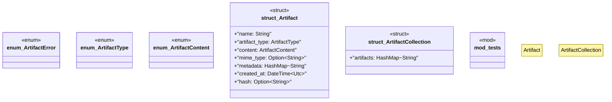

# `crates/ggen-lsp/src/a2a_mcp/a2a/artifact.rs`

Source SHA-256: `292179029b1d2c867d68a1999181a67c47840a19e8d32ff9925f485fd84470f0`

## Dependencies

- `chrono::{DateTime, Utc}`
- `serde::{Deserialize, Serialize}`
- `std::collections::HashMap`
- `std::path::PathBuf`
- `super::*`
- `thiserror::Error`

## Standing

- Structural parse: `ALIVE`
- Runtime behavior: `UNKNOWN`
