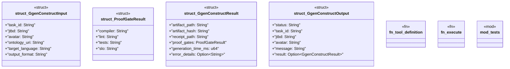

# `crates/ggen-lsp/src/a2a_mcp/a2a/ggen_construct.rs`

Source SHA-256: `760802f829345b2d46a5579e0839d1d62dcd25df5bdd6781f2f0f2da5de31e1c`

## Dependencies

- `serde::{Deserialize, Serialize}`
- `std::time::Instant`
- `super::*`

## Standing

- Structural parse: `ALIVE`
- Runtime behavior: `UNKNOWN`
