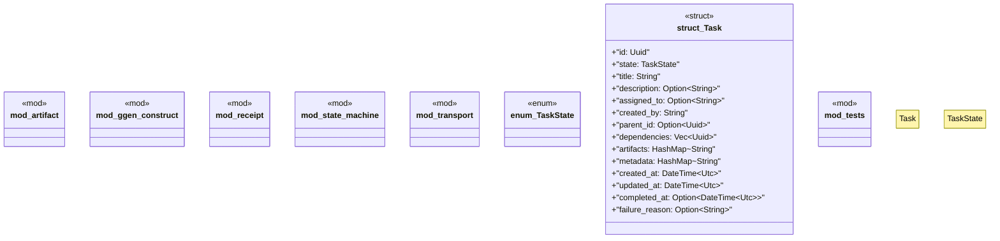

# `crates/ggen-lsp/src/a2a_mcp/a2a/mod.rs`

Source SHA-256: `389abd6f03e7a087052a739728013b20e153deb01104e8efe5b247bf0b45345d`

## Dependencies

- `artifact::{Artifact, ArtifactCollection, ArtifactContent, ArtifactError, ArtifactType}`
- `chrono::{DateTime, Utc}`
- `receipt::{A2ARefusalState, A2AState, A2ATaskReceipt, Avatar8, Jtbd8}`
- `serde::{Deserialize, Serialize}`
- `state_machine::{StateTransition, TaskStateMachine, TransitionError}`
- `std::collections::HashMap`
- `super::*`
- `transport::{Envelope, TaskMessage, Transport, TransportError}`
- `uuid::Uuid`

## Standing

- Structural parse: `ALIVE`
- Runtime behavior: `UNKNOWN`
