# `crates/ggen-lsp/src/a2a_mcp/a2a/receipt.rs`

Source SHA-256: `b3d3d4a467f265b64a21d8e7e910cb00c49d65cd281dcf3f086a7c6f27197bd0`

```mermaid
classDiagram
    class enum_Avatar8 {
      <<enum>>
    }
    class enum_Jtbd8 {
      <<enum>>
    }
    class enum_A2AState {
      <<enum>>
    }
    class enum_A2ARefusalState {
      <<enum>>
    }
    class struct_OcelObjectRef {
      <<struct>>
      +"id: String"
      +"qualifier: Option~String~"
    }
    class struct_OcelEvent {
      <<struct>>
      +"id: String"
      +"activity: String"
      +"timestamp: String"
      +"objects: Vec~OcelObjectRef~"
      +"attributes: std::collections::HashMap~String"
    }
    class struct_OcelObject {
      <<struct>>
      +"id: String"
    }
    class struct_ReceiptOcelSlice {
      <<struct>>
      +"schema: String"
      +"events: Vec~OcelEvent~"
      +"objects: Vec~OcelObject~"
      +"canonical_hash: String"
    }
    class struct_McpInvocationEvidence {
      <<struct>>
      +"server: String"
      +"transport: String"
      +"tool_name: String"
      +"tool_call_hash: Option~String~"
    }
    class struct_ExpectedPathEvidence {
      <<struct>>
      +"route_id: String"
      +"expected_ocel_hash: Option~String~"
      +"expected_artifact: String"
    }
    class struct_ObservedPathEvidence {
      <<struct>>
      +"ocel: ReceiptOcelSlice"
      +"observed_ocel_hash: String"
      +"observed_artifact_hash: Option~String~"
    }
    class struct_AlignmentEvidence {
      <<struct>>
      +"expected_vs_observed: String"
      +"missing_events: Vec~String~"
      +"unexpected_events: Vec~String~"
      +"refusal_state: Option~A2ARefusalState~"
    }
    class struct_ValidationResult {
      <<struct>>
      +"admitted: bool"
      +"refusal_state: Option~A2ARefusalState~"
    }
    class struct_A2ATaskReceipt {
      <<struct>>
      +"receipt_type: String"
      +"receipt_schema: String"
      +"hash_algorithm: String"
      +"avatar: Avatar8"
      +"jtbd: Jtbd8"
      +"task_id: String"
      +"status: A2AState"
      +"mcp: McpInvocationEvidence"
      +"expected_path: ExpectedPathEvidence"
      +"observed_path: ObservedPathEvidence"
      +"alignment: AlignmentEvidence"
      +"refusal_state: Option~A2ARefusalState~"
      +"previous_receipt_hash: Option~String~"
      +"receipt_hash: String"
    }
    note "A2ATaskReceipt"
    note "ReceiptOcelSlice"
    note "ValidationResult"
```

## Dependencies

- `serde::{Deserialize, Serialize}`

## Standing

- Structural parse: `ALIVE`
- Runtime behavior: `UNKNOWN`
