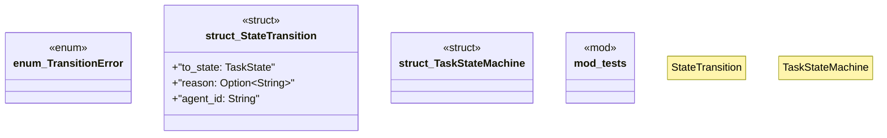

# `crates/ggen-lsp/src/a2a_mcp/a2a/state_machine.rs`

Source SHA-256: `9e8d43c606bdb444cfbfa73979fc654dbac89a336084c5bfcb4dfc7790a77e9d`

## Dependencies

- `chrono::Utc`
- `crate::a2a_mcp::a2a::{Task, TaskState}`
- `serde::{Deserialize, Serialize}`
- `super::*`
- `thiserror::Error`

## Standing

- Structural parse: `ALIVE`
- Runtime behavior: `UNKNOWN`
