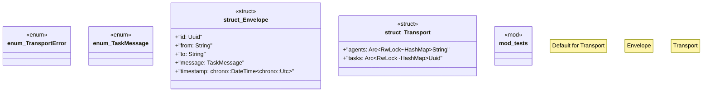

# `crates/ggen-lsp/src/a2a_mcp/a2a/transport.rs`

Source SHA-256: `5eca688851dd28118c3eb75eefa36ee7de0567a9ad29aba1462014b927414b6a`

## Dependencies

- `crate::a2a_mcp::a2a::{Task, TaskState}`
- `serde::{Deserialize, Serialize}`
- `std::collections::HashMap`
- `std::sync::Arc`
- `super::*`
- `thiserror::Error`
- `tokio::sync::{mpsc, RwLock}`
- `uuid::Uuid`

## Standing

- Structural parse: `ALIVE`
- Runtime behavior: `UNKNOWN`
