# `crates/ggen-lsp/src/a2a_mcp/a2a_generated/adapter.rs`

Source SHA-256: `d605d4532a8c4198e8eddf8a17f984ca6dd262a5379eac50e3d32e67d006eb95`

```mermaid
classDiagram
    class trait_Adapter {
      <<trait>>
      +"name(&self) -~ &str"
      +"version(&self) -~ &str"
      +"initialize(&mut self, config: serde_json::Value) -~ Result~(), AdapterError~"
      +"can_handle(&self, format: &str) -~ bool"
      +"to_a2a(&self, message: &serde_json::Value) -~ Result~serde_json::Value, AdapterError~"
      +"from_a2a(
        &self, message: &serde_json::Value,
    ) -~ Result~serde_json::Value, AdapterError~"
      +"capabilities(&self) -~ AdapterCapabilities"
      +"shutdown(&mut self) -~ Result~(), AdapterError~"
    }
    class struct_AdapterCapabilities {
      <<struct>>
      +"supported_formats: Vec~String~"
      +"max_message_size: usize"
      +"supports_encryption: bool"
      +"supports_compression: bool"
      +"capabilities: HashMap~String"
    }
    class struct_AdapterError {
      <<struct>>
      +"message: String"
      +"error_type: AdapterErrorType"
      +"details: Option~serde_json::Value~"
    }
    class enum_AdapterErrorType {
      <<enum>>
    }
    class struct_BaseAdapter {
      <<struct>>
      +"name: String"
      +"version: String"
      +"config: serde_json::Value"
      +"initialized: bool"
      +"capabilities: AdapterCapabilities"
    }
    class struct_JsonAdapter {
      <<struct>>
      +"base: BaseAdapter"
    }
    class struct_XmlAdapter {
      <<struct>>
      +"base: BaseAdapter"
    }
    class struct_AdapterRegistry {
      <<struct>>
      +"adapters: HashMap~String"
    }
    class struct_MessageConverter {
      <<struct>>
      +"registry: AdapterRegistry"
    }
    class mod_tests {
      <<mod>>
    }
    note "Adapter for BaseAdapter"
    note "Adapter for JsonAdapter"
    note "Adapter for XmlAdapter"
    note "AdapterError"
    note "AdapterRegistry"
    note "BaseAdapter"
    note "Default for AdapterRegistry"
    note "Default for JsonAdapter"
    note "Default for MessageConverter"
    note "Default for XmlAdapter"
    note "JsonAdapter"
    note "MessageConverter"
    note "XmlAdapter"
    note "std::error::Error for AdapterError"
    note "std::fmt::Display for AdapterError"
    note "std::fmt::Display for AdapterErrorType"
```

## Dependencies

- `async_trait::async_trait`
- `std::collections::HashMap`
- `super::*`

## Standing

- Structural parse: `ALIVE`
- Runtime behavior: `UNKNOWN`
