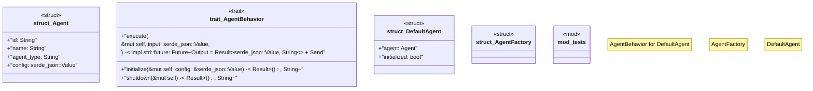

# `crates/ggen-lsp/src/a2a_mcp/a2a_generated/agent.rs`

Source SHA-256: `b78bb65293486ed21c30e168e514190d6fc80488672c0d7d6c94fc825b0041b5`

## Dependencies

- `super::*`

## Standing

- Structural parse: `ALIVE`
- Runtime behavior: `UNKNOWN`
