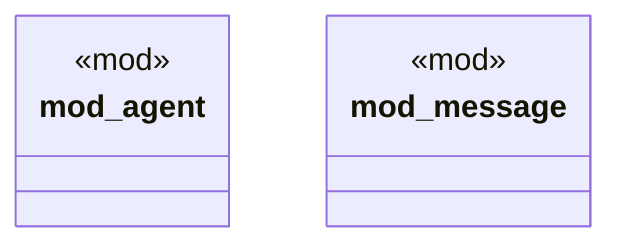

# `crates/ggen-lsp/src/a2a_mcp/a2a_generated/converged/mod.rs`

Source SHA-256: `6aa063689f54fac677e6d406b2f99b99fac37720562745c1d0dd8967582b522a`

## Dependencies

- `agent::{ AgentCapabilities, AgentCommunication, AgentError, AgentExecution, AgentHealth, AgentIdentity, AgentLifecycle, AgentMetrics, AgentProtocol, AgentSecurity, AgentState, AuditConfig, AuditEvent, AuthenticationConfig, AuthenticationMethod, AuthenticationProvider, AuthorizationConfig, AuthorizationModel, AuthorizationRole, Capability, ComparisonOperator, ComplianceConfig, ComplianceControl, ComplianceFramework, ComplianceRequirement, ComplianceStandard, DataFormat, DestinationType, EncryptionAlgorithm, EncryptionConfig, EncryptionKey, EncryptionMode, ExecutionMode, ExecutionStrategy, HealthStatus, Permission, PermissionScope, PermissionType, PolicyEffect, PolicyPriority, PolicyType, ProviderType, QoSLevel, RequirementType, ResourceConstraints, RetentionPolicy, SecurityPolicies, SecurityPolicy, SecurityRule, UnifiedAgent, UnifiedAgentBuilder, ValidationAction, ValidationRule, ValidationSeverity, }`
- `message::{ ConvergedMessage, ConvergedMessageBuilder, ConvergedMessageType, ConvergedPayload, ConversationContext, DomainContext, EncryptionRequirements, HandlerAction, HandlerPriority, HandlerStatus, LatencyRequirements, MessageEnvelope, MessageHints, MessageIntegrity, MessageLifecycle, MessagePriority, MessageRouter, MessageRouting, MessageState, MessageStateTransition, MessageTimeout, ProcessingHints, QoSRequirements, ReliabilityLevel, ResourceRequirements, Route, RouteAction, RoutingCondition, RoutingRule, SecurityClassification, SecurityHints, TaskContext, TaskStatus, TemporalContext, ThroughputRequirements, TimeoutType, UnifiedContent, UnifiedContext, UnifiedFileContent, }`

## Standing

- Structural parse: `ALIVE`
- Runtime behavior: `UNKNOWN`
