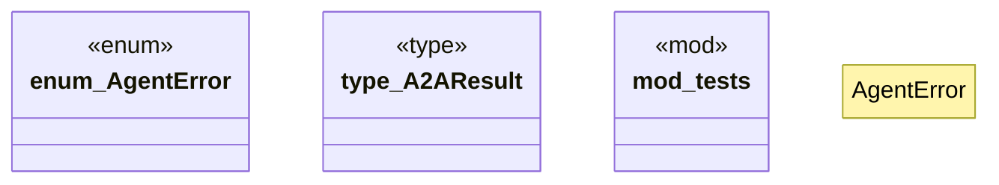

# `crates/ggen-lsp/src/a2a_mcp/a2a_generated/error.rs`

Source SHA-256: `99a35c8cf363e7bdd472807feed41eec593fe7998aac6d30dfc0d8b3475bc7f9`

## Dependencies

- `std::error::Error`
- `std::io`
- `std::io::ErrorKind`
- `super::*`

## Standing

- Structural parse: `ALIVE`
- Runtime behavior: `UNKNOWN`
