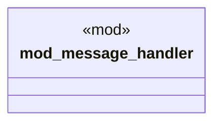

# `crates/ggen-lsp/src/a2a_mcp/a2a_generated/handlers.rs`

Source SHA-256: `ba37bb039d5f3e655e4dc48ebeeae928b823b58cd2c79842d16beeb8609e613f`

## Dependencies

- `async_trait::async_trait`
- `chrono::{DateTime, Utc}`
- `crate::a2a_mcp::a2a_generated::converged::UnifiedContent`
- `crate::a2a_mcp::a2a_generated::converged::{ ConvergedMessage, ConvergedMessageType, ConvergedPayload, LatencyRequirements, MessageEnvelope, MessageLifecycle, MessagePriority, MessageRouting, MessageState, QoSRequirements, ReliabilityLevel, ThroughputRequirements, UnifiedContent, }`
- `message_handler::*`
- `serde::{Deserialize, Serialize}`
- `std::collections::HashMap`
- `super::*`

## Standing

- Structural parse: `ALIVE`
- Runtime behavior: `UNKNOWN`
